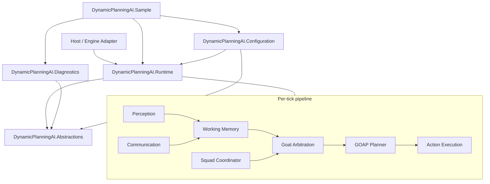

# DynamicPlanningAI (DP_AI)

Engine-agnostic, deterministic Goal-Oriented Action Planning (GOAP) framework for
tactical AI agents. Written in C# targeting .NET 10, with bounded capacities,
Power-of-Ten style constraints, and host-facing contracts that do not depend on
any game engine.

## Naming

| Form | Meaning |
|------|---------|
| **DynamicPlanningAI** | Full product / solution / assembly / namespace name |
| **DP_AI** | Accepted short form of DynamicPlanningAI |
| **DP** | Always means **DynamicPlanning** (never a standalone product name) |

Task identifiers use the `DP-` prefix (for example `DP-PLN-001`) because **DP**
means **DynamicPlanning**. See [docs/NAMING.md](docs/NAMING.md).

## Fidelity disclaimer

DynamicPlanningAI is **inspired by publicly documented F.E.A.R.-era GOAP / tactical AI
principles**. It is **original engineering**, not a reverse-engineered or
proprietary reproduction of any commercial AI codebase. See [NOTICE.md](NOTICE.md)
and [docs/PUBLIC_SOURCE_FIDELITY.md](docs/PUBLIC_SOURCE_FIDELITY.md).

## Features

- **Backward regression A\*** planner over a bit-mask symbolic world state
- **Incremental planning** with per-step expansion budgets and explicit
  `PlannerStatus` outcomes
- **Goal arbitration** selecting among competing agent goals each tick
- **Action execution** lifecycle with volatile precondition checks and typed
  failure reasons
- **Perception and working memory** feeding quantized world facts
- **Target / weapon selection**, **tactical points**, and **cover reservation**
- **Navigation host contracts** (engine-agnostic path queries)
- **Squad coordination** and **semantic communication** intents
- **Deterministic ticks** via host-provided `AiTick` (no wall-clock reads)
- **Frozen runtime path** with allocation discipline and audit tooling
- **Console sample** scenarios (e.g. `BasicAttack`) for regression demos

## Solution layout

| Project | Role |
|---------|------|
| `DynamicPlanningAI.Abstractions` | Contracts, identifiers, limits, domain enums |
| `DynamicPlanningAI.Runtime` | Planner, memory, cover, squad, execution |
| `DynamicPlanningAI.Configuration` | Validated immutable config loading |
| `DynamicPlanningAI.Diagnostics` | Tracing, formatters, contract helpers |
| `DynamicPlanningAI.Sample` | Deterministic console simulation |
| `DynamicPlanningAI.Audit` | Power-of-Ten / allocation-path source audit |
| `tests/*` | Unit, integration, simulation, architecture tests |

**Dependency direction:**  
`Abstractions` ← `Runtime` ← `Configuration` ← `Sample`  
`Abstractions` ← `Diagnostics` (also referenced by Sample)

## Build, test, and sample commands

```bash
export PATH="$HOME/.dotnet:$PATH"

dotnet restore
dotnet build --configuration Release
dotnet test --configuration Release --no-build
dotnet format --verify-no-changes
dotnet run --project tools/DynamicPlanningAI.Audit --configuration Release
dotnet run --project src/DynamicPlanningAI.Sample --configuration Release -- --scenario BasicAttack
```

Requires the .NET SDK version pinned in `global.json` (10.0.x).

## Architecture overview



See [docs/ARCHITECTURE.md](docs/ARCHITECTURE.md) for subsystem boundaries and
lifecycle states.

## Documentation index

| Document | Topic |
|----------|-------|
| [docs/ARCHITECTURE.md](docs/ARCHITECTURE.md) | Layers, lifecycle, tick pipeline |
| [docs/PUBLIC_SOURCE_FIDELITY.md](docs/PUBLIC_SOURCE_FIDELITY.md) | Inspiration vs. originality |
| [docs/POWER_OF_TEN_COMPLIANCE.md](docs/POWER_OF_TEN_COMPLIANCE.md) | NASA Power of Ten → C# |
| [docs/GOAP_PLANNER.md](docs/GOAP_PLANNER.md) | Backward regression A* |
| [docs/WORLD_STATE_MODEL.md](docs/WORLD_STATE_MODEL.md) | Symbolic facts and ownership |
| [docs/GOAL_ARBITRATION.md](docs/GOAL_ARBITRATION.md) | Goal selection |
| [docs/ACTION_EXECUTION.md](docs/ACTION_EXECUTION.md) | Action lifecycle |
| [docs/PERCEPTION_AND_MEMORY.md](docs/PERCEPTION_AND_MEMORY.md) | Sensors and working memory |
| [docs/TARGET_AND_WEAPON_SELECTION.md](docs/TARGET_AND_WEAPON_SELECTION.md) | Focus and loadout |
| [docs/TACTICAL_POINTS_AND_COVER.md](docs/TACTICAL_POINTS_AND_COVER.md) | Cover / flanking demo |
| [docs/NAVIGATION_INTEGRATION.md](docs/NAVIGATION_INTEGRATION.md) | Path host contracts |
| [docs/SQUAD_COORDINATION.md](docs/SQUAD_COORDINATION.md) | Squad behaviors and orders |
| [docs/COMMUNICATION_SYSTEM.md](docs/COMMUNICATION_SYSTEM.md) | Semantic intents |
| [docs/DETERMINISM.md](docs/DETERMINISM.md) | Tick and RNG rules |
| [docs/MEMORY_AND_ALLOCATIONS.md](docs/MEMORY_AND_ALLOCATIONS.md) | Bounds and freeze path |
| [docs/CONFIGURATION.md](docs/CONFIGURATION.md) | Config validation |
| [docs/ENGINE_INTEGRATION_GUIDE.md](docs/ENGINE_INTEGRATION_GUIDE.md) | Hosting in any engine |
| [docs/EXTENDING_GOALS_AND_ACTIONS.md](docs/EXTENDING_GOALS_AND_ACTIONS.md) | Authoring extensions |
| [docs/DEBUGGING_AND_TRACING.md](docs/DEBUGGING_AND_TRACING.md) | Diagnostics |
| [docs/TESTING.md](docs/TESTING.md) | Test strategy |
| [docs/PERFORMANCE.md](docs/PERFORMANCE.md) | Budgets and profiling |
| [docs/FAILURE_MODES.md](docs/FAILURE_MODES.md) | Explicit failure handling |
| [docs/DESIGN_DECISIONS.md](docs/DESIGN_DECISIONS.md) | ADRs |
| [docs/REQUIREMENTS_TRACEABILITY.md](docs/REQUIREMENTS_TRACEABILITY.md) | REQ → files |
| [docs/BACKLOG.md](docs/BACKLOG.md) | Task backlog |

## Hard limits (summary)

Absolute ceilings live in `AiHardLimits` (Abstractions). Examples:

| Limit | Value |
|-------|------:|
| Agents | 64 |
| Squads | 16 |
| Goals per agent | 32 |
| Plan length | 16 |
| Planner nodes | 512 |
| World facts | 64 |
| Tactical points | 256 |

Runtime configuration may only select values **at or below** these ceilings.

## Limitations

- Runtime, configuration loaders, sample scenarios, and audit rules are under
  active implementation; Abstractions contracts and limits are the stable
  foundation today. Track status in
  [docs/REQUIREMENTS_TRACEABILITY.md](docs/REQUIREMENTS_TRACEABILITY.md).
- Planning is symbolic only; continuous combat math belongs in the host or in
  pre-planning quantizers.
- Navigation mesh queries are **host-provided**; the library does not embed a
  pathfinder.
- Not a full animation, physics, or networking stack.
- Single-threaded tick assumption: the host must serialize `AiRuntime` ticks.

## License

MIT — see [LICENSE.md](LICENSE.md). Third-party and inspiration notices:
[NOTICE.md](NOTICE.md).
