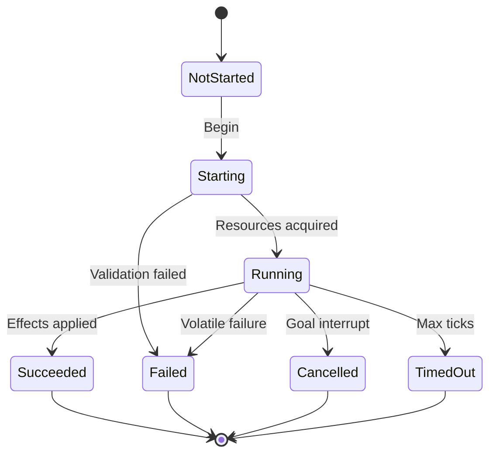

# Action Execution

The executor advances the current plan one action at a time under the host tick.
Actions are not instantaneous scripts; they expose an explicit lifecycle and
typed failure reasons.

Related: [GOAP_PLANNER.md](GOAP_PLANNER.md),
[WORLD_STATE_MODEL.md](WORLD_STATE_MODEL.md),
[NAVIGATION_INTEGRATION.md](NAVIGATION_INTEGRATION.md),
[FAILURE_MODES.md](FAILURE_MODES.md).

## Lifecycle (`ActionStatus`)

| Status | Meaning |
|--------|---------|
| `NotStarted` | Plan slot not begun |
| `Starting` | Acquire reservations, paths, animations |
| `Running` | Per-tick progress |
| `Succeeded` | Commit effects; advance plan index |
| `Failed` | See `ActionFailureReason` |
| `Cancelled` | Higher goal or squad cancel |
| `TimedOut` | Exceeded `MaximumActionTicks` (1024) |

## Failure reasons (`ActionFailureReason`)

Failures are explicit so diagnostics and replanning policies stay deterministic:

| Reason | Typical trigger |
|--------|-----------------|
| `InvalidPrecondition` | Volatile bit cleared |
| `TargetLost` / `TargetDead` | Focus invalid |
| `NoAmmunition` | Ammo fact cleared |
| `NoPath` / `PathInvalidated` | Nav host |
| `DestinationOccupied` | Capacity / reservation |
| `CoverInvalidated` / `ReservationLost` | Cover system |
| `DoorBlocked` / `DoorDestroyed` | Interaction |
| `TraversalUnavailable` | Link down |
| `AnimationRejected` / `WeaponRejected` / `InteractionRejected` | Host services |
| `DangerChanged` | Mid-action danger |
| `OrderExpired` | Squad order lifetime |
| `MaximumTickCountReached` | Timeout |
| `HostServiceFailure` | Unclassified host error |

## Per-tick execution steps

1. If no plan, return to arbitration / planning.
2. Validate volatile preconditions of the current action.
3. Call host services as needed (move, fire, animate).
4. On success path completion, apply symbolic effects to the agent mask.
5. On failure, record reason, release reservations, request replan (bounded by
   `MaximumReplanningAttempts`).
6. On full plan success, mark goal satisfied if desire mask holds.

## Action definitions vs. candidates

- **Definitions** — immutable templates registered at configuration
  (`MaximumActionDefinitions` = 128).
- **Candidates** — grounded instances with parameters (target, tactical point,
  door) generated for a planning request (`MaximumActionCandidates` = 256).

See [EXTENDING_GOALS_AND_ACTIONS.md](EXTENDING_GOALS_AND_ACTIONS.md).

## Contracts with the host

Executors never call engine APIs directly. They call abstracted host services
and map rejections to failure reasons
([ENGINE_INTEGRATION_GUIDE.md](ENGINE_INTEGRATION_GUIDE.md)).

## Implementation status

Enums and limits: **Implemented**. Executor runtime: **Pending**
(`REQ-GOAP-001`).
