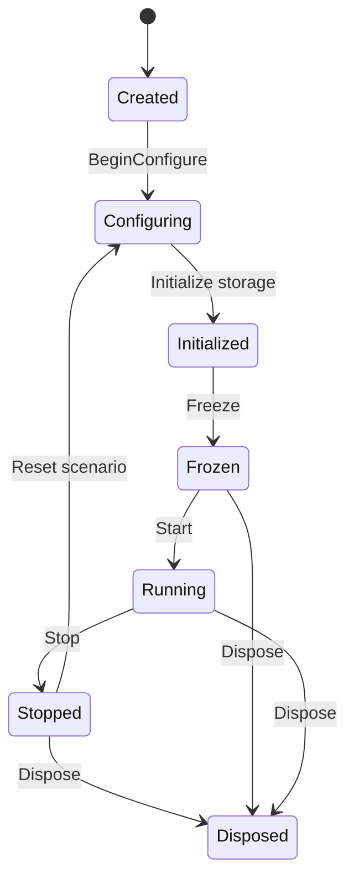

# Architecture

TacticalGoap separates **contracts** from **runtime**, **configuration**, and
**diagnostics** so hosts can integrate the planner without pulling engine-specific
code into the core. This document describes layers, lifecycle, tick pipeline,
and capacity model.

Related: [GOAP_PLANNER.md](GOAP_PLANNER.md), [WORLD_STATE_MODEL.md](WORLD_STATE_MODEL.md),
[DETERMINISM.md](DETERMINISM.md), [MEMORY_AND_ALLOCATIONS.md](MEMORY_AND_ALLOCATIONS.md),
[DESIGN_DECISIONS.md](DESIGN_DECISIONS.md).

## Layer responsibilities

| Layer | Assembly | Responsibility |
|-------|----------|----------------|
| Contracts | `TacticalGoap.Abstractions` | Identifiers, enums, hard limits, result types, lifecycle states, frozen-path attribute |
| Runtime | `TacticalGoap.Runtime` | Perception, memory, goals, planner, execution, cover, squad, communication |
| Configuration | `TacticalGoap.Configuration` | Load, validate, and freeze immutable scenario/agent definitions |
| Diagnostics | `TacticalGoap.Diagnostics` | Ring-buffer consumers, formatters, contract assertions (depends only on Abstractions) |
| Sample | `TacticalGoap.Sample` | Console host demonstrating scenarios without a game engine |
| Audit | `TacticalGoap.Audit` | Offline Roslyn scan for Power-of-Ten / allocation discipline |

### Dependency rules

```
Abstractions  <──  Runtime  <──  Configuration  <──  Sample
Abstractions  <──  Diagnostics  ───────────────────► Sample
```

- Production runtime code must not reference Configuration or Sample.
- Diagnostics must not reference Runtime (avoids circular coupling; diagnostics
  consume Abstractions types and host-exported event buffers).
- Architecture tests enforce project-reference direction (see [TESTING.md](TESTING.md)).

## Runtime lifecycle

States are defined by `RuntimeLifecycleState`:



| State | Allocations | Typical work |
|-------|-------------|--------------|
| Created | Allowed | Construct runtime shell |
| Configuring | Allowed | Register agents, goals, actions, tactical points |
| Initialized | Allowed | Allocate fixed buffers sized from validated config |
| Frozen | **Forbidden** on `[FrozenRuntimePath]` | Seal tables; validate invariants |
| Running | **Forbidden** on frozen path | Process `AiTick` |
| Stopped | Reset of counters only | Scenario teardown |
| Disposed | None | Release host-held resources |

After `Freeze()`, configuration mutation APIs return
`OperationStatus.InvalidLifecycleState`. See
[MEMORY_AND_ALLOCATIONS.md](MEMORY_AND_ALLOCATIONS.md).

## Per-tick pipeline

The host advances simulated time with `AiTick(sequence, deltaMilliseconds)`.
The runtime never reads wall-clock time.

Recommended order inside one tick (agents processed in stable identifier order):

1. **Ingress** — drain host-provided perception, sound, damage, and danger events
   into bounded buffers (`AiHardLimits.MaximumPerceptionCandidates`, etc.).
2. **Perception / memory** — update working-memory records; expire stale evidence.
3. **Quantize world state** — map continuous host facts into `WorldFactId` bits.
4. **Target / weapon selection** — refresh focus and loadout facts.
5. **Squad coordination** — issue or refresh orders; write squad facts.
6. **Communication** — arbitrate pending intents into memory/events.
7. **Goal arbitration** — select active goal per agent.
8. **Planning** — incremental backward A* within expansion/step budgets.
9. **Execution** — advance current action; handle failures and replanning.
10. **Diagnostics** — append structured records to the ring buffer (optional).

Budgets: `MaximumPlannerStepsPerTick`, `MaximumPlannerExpansionsPerStep`,
`MaximumActionTicks`. Exceeding a budget yields an explicit status, never an
unbounded loop.

## Subsystem map

| Subsystem | Doc | Key Abstractions types |
|-----------|-----|------------------------|
| World state | [WORLD_STATE_MODEL.md](WORLD_STATE_MODEL.md) | `WorldFactId` |
| Planner | [GOAP_PLANNER.md](GOAP_PLANNER.md) | `PlannerResult`, `PlannerStatus` |
| Goals | [GOAL_ARBITRATION.md](GOAL_ARBITRATION.md) | `GoalId` |
| Actions | [ACTION_EXECUTION.md](ACTION_EXECUTION.md) | `ActionStatus`, `ActionFailureReason` |
| Perception | [PERCEPTION_AND_MEMORY.md](PERCEPTION_AND_MEMORY.md) | `MemoryType`, `MemoryRecordId` |
| Targeting | [TARGET_AND_WEAPON_SELECTION.md](TARGET_AND_WEAPON_SELECTION.md) | `EntityId`, `WeaponId` |
| Cover | [TACTICAL_POINTS_AND_COVER.md](TACTICAL_POINTS_AND_COVER.md) | `TacticalPointId`, `TacticalPointCategory` |
| Navigation | [NAVIGATION_INTEGRATION.md](NAVIGATION_INTEGRATION.md) | `NavigationNodeId`, `NavigationAreaId` |
| Squad | [SQUAD_COORDINATION.md](SQUAD_COORDINATION.md) | `SquadId`, `SquadOrderType`, `SquadBehaviorType` |
| Communication | [COMMUNICATION_SYSTEM.md](COMMUNICATION_SYSTEM.md) | `CommunicationIntentType` |
| Diagnostics | [DEBUGGING_AND_TRACING.md](DEBUGGING_AND_TRACING.md) | `DiagnosticSubsystem` |

## Capacity model

All fixed tables are sized at most to `AiHardLimits`. Configuration may clamp
downward. Changing a hard limit is an architecture decision: update
`AiHardLimits`, this document, [PERFORMANCE.md](PERFORMANCE.md), audit rules,
and capacity tests together.

## Host integration surface

Hosts implement narrow service interfaces (navigation query, animation request,
weapon fire request, interaction request). The runtime returns
`OperationStatus` / `ActionFailureReason` instead of throwing for expected
failures. See [ENGINE_INTEGRATION_GUIDE.md](ENGINE_INTEGRATION_GUIDE.md).

## Sample and tools

- `TacticalGoap.Sample` — deterministic console scenarios (`--scenario BasicAttack`).
- `TacticalGoap.Audit` — offline compliance over the source tree.

## Implementation status

Abstractions contracts, limits, and enums are present. Runtime subsystems,
configuration loaders, sample scenarios, and audit rules are tracked as
partially implemented or pending in
[REQUIREMENTS_TRACEABILITY.md](REQUIREMENTS_TRACEABILITY.md).
